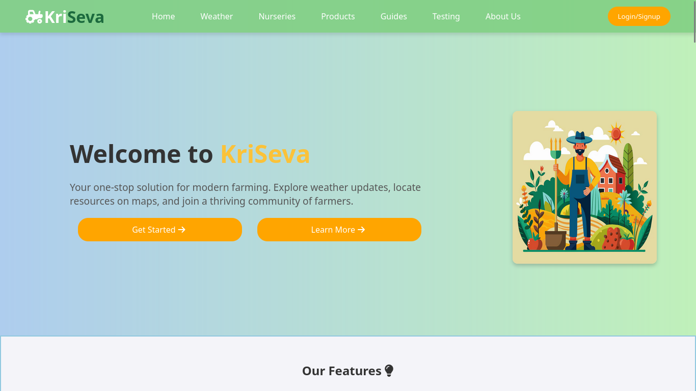
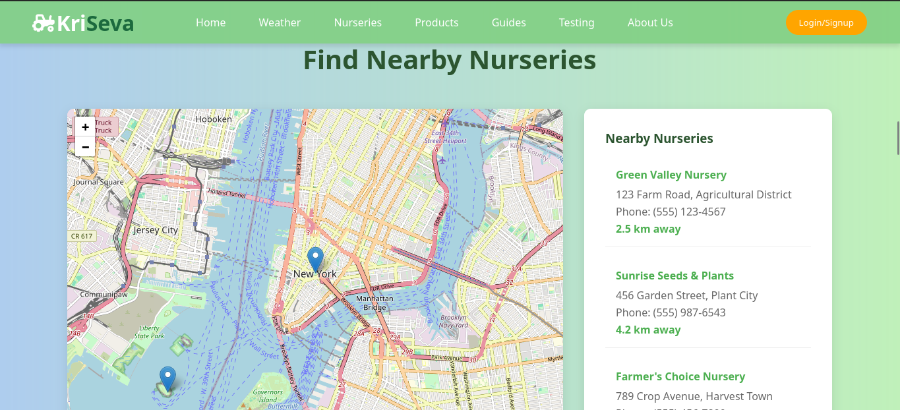

# 🌱 My Kriseva Webpage

## 📌 Overview
A brief, catchy description of your webpage:
> This is a responsive and interactive website for **Kriseva**, designed to users easily locate nearby nurseries using a dynamic Leaflet.js map.
> The site provides a clean, mobile-friendly interface where users can view nursery locations, contact details, distances, guidence through farming videos, soil testing, and pesticides product— all in one place.
> Whether you’re a gardener, farmer, or plant enthusiast, this tool simplifies the process of finding the best nurseries around you.

## 🚀 Features
- ✅ Responsive Design 
🌍 Interactive Map (Leaflet.js)
📞 Contact Information 
🎨 Clean & Modern UI 
📍 Realistic Location Markers 
🔍 Easy Navigation 
⚡ Fast Loading 
🛠 Easy to Customize 
📊 Organized Listings 
🗺 OpenStreetMap Integration 

## 🛠️ Tech Stack
- **HTML5**
- **CSS3 / Tailwind**
- **JavaScript (Vanilla / ES6)**
- **Leaflet.js** for maps

## 📸 Screenshots
<!-- Add a few images of your website -->



## 📍 Live Demo
🔗 [Click here to view live website]([(https://github.com/Rashi-007/Rough-KriSeva.git)])

## 📂 Installation & Setup
```bash
# Clone the repository
git clone (https://github.com/Rashi-007/Rough-KriSeva.git)

# Open index.html in your browser
